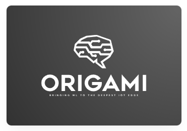

## Summary of Business
Here we'll introduce [TinyML](https://www.tinyml.org/) and [TinyML as-a-Service](https://www.ericsson.com/en/blog?query=TinyML), running ML inferences on microcontrollers in IoT sensors, which won't rely on network and Cloud unnecessarily. This would enable new secure and energy efficient use cases of ML applications (e.g., military, healthcare and maritime scenarios).  Origami aims to solve the problem that current Machine Learning (ML) systems always run-on big Cloud GPUs, which highly relies on network (latency, throughput, and reliability). This network dependency sometimes restricts potential ML use cases. Also moving sensor data from on-premises to the cloud isn't always ensured securely. For further information please check their YouTube Video, https://youtu.be/m2sHB4DOfMg

## Business Model Canvas

<table>
  <tr>
    <td rowspan="2">
      <b><a href="Key_Partners.md">Key Partners</a></b>
      
Who are our Key Partners? 
      Who are our key suppliers? 
      Which Key Activities do partners perform?

    </td>
    <td>
      <b><a href="Key_Activities.md">Key Activities</a></b>
      
What Key Activities do our Value Propositions require? 
      Our Distribution Channels? 
      Customer Relationships? 
      Revenue Streams?

    </td>
    <td rowspan="2" colspan="2">
      <b><a href="Value_Propositions.md">Value Propositions</a></b>
      
What value do we deliver to the customer? 
      Which one of our customer's problems are we helping to solve? 
      What bundles of products and services are we offering to each Customer Segment? 
      are different and  
      worth paying  
      attention

           
    </td>
    <td>
      <b><a href="Customer_Relationships.md">Customer Relationships</a></b>
      
What type of relationship does each of our Customer Segments expects us to establish and maintain with them? 
      Which ones have we established?

    </td>
    <td rowspan="2">
      <b><a href="Customer_Segments.md">Customer Segments</a></b>
      
For whom are we creating value? 
      Who are our most important customers?

    </td>
  </tr>
  <tr>
    <td>
      <b><a href="Key_Resources.md">Key Resources</a></b>
      
What Key Resources do our Value Propositions require? 
      Our Distribution Channels? 
        Customer Relationships? 
        Revenue Streams?

    </td>
    <td>
      <b><a href="Channels.md">Channels</a></b>
      
Through which Channels do our Customer Segments want to be reached? 
      How are our Channels integrated?
      How are we integrated with customer routines?

    </td>
  </tr>
  <tr>
    <td colspan="3">
      <b><a href="Financial_Plan.md">Cost Structure</a></b>
      
What are the most important costs to our business? 
      Which Key Resources are most expensive? 
      Which Key Activities are most expensive? 
      How does it coes to establish and run the business?

    </td>
    <td colspan="3">
      <b><a href="Financial_Plan.md">Revenue Streams</a></b>
      
For what value are customers willing to pay?  
      How would they prefer to pay?  
      What is the revenue structure?

    </td>
  </tr>
</table>

## Founders
<!-- Team members -->
* [Hiroshi Doyu](https://www.linkedin.com/in/hidoyu/), Project Lead
* Haruka Doyu, Developer
